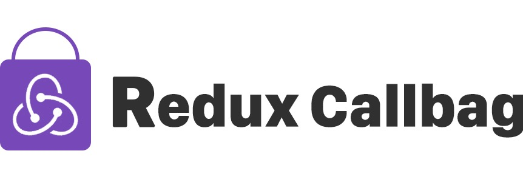

[](https://badge.fury.io/js/redux-callbag)
[](https://travis-ci.org/janryWang/redux-callbag)

# 

> Redux middleware for action side effects with [callbag](https://github.com/callbag/callbag)
>
> You may not need redux-saga/redux-observable. When you use redux-callbag, you will find that this's what you want.
>
> - 🙀 Minisize
> - 🙀 Scalable
> - 🙀 Easy to understand


## Install

```sh
npm install --save  redux-callbag
```

## Try it online

- [async-redux-callbag](https://codesandbox.io/s/20n7npjnj)


## Usage

```js
import { createStore, applyMiddleware } from "redux"
import { pipe, filter, forEach, map } from "callbag-basics"
import createCallbagMiddleware from "./index"
import delay from 'callbag-delay'

const  todos = (state = [], action)=> {
    switch (action.type) {
        case "ADD_TODO":
            return state.concat([action.payload])
        case "REMOVE_TODO":
            return []
        case "ADD_SOMETHING":
            return state.concat([action.payload])
        default:
            return state
    }
}

const addTodo = (payload)=> {
    return {
        type: "ADD_TODO",
        payload
    }
}

const addSomething = (payload)=> {
    return {
        type: "ADD_SOMETHING",
        payload
    }
}

const removeTodo = ()=> {
    return {
        type: "REMOVE_TODO"
    }
}


const store = createStore(
    todos,
    ["Hello world"],
    applyMiddleware(
        createCallbagMiddleware((actions, store) => {
            const {
                select,
                mapPromise,
                mapSuccessTo,
                mapFailTo
            } = actions
            
            actions
                |> select("ADD_SOMETHING")
                |> delay(1000)
                |> forEach(({ payload }) => {
                    console.log("log:" + payload)
                })

            actions
                |> select("ADD_TODO")
                |> delay(1000)
                |> mapPromise((d)=>fetch('/xxxx',{data:d}).then(res=>res.json()))
                |> mapSuccessTo("ADD_SOMETHING",(payload)=>payload + "  23333333")
        })
    )
)

store.dispatch(addTodo("Hello redux"))
store.dispatch(addSomething("This will not add numbers"))

console.log(store.getState())

store.subscribe(()=>{
    console.log(store.getState())
})


```


## API


#### `createCallbagMiddleware([...epics : Array<(actions : Function,store : Object) {} ：any>]) : Function`

> This API is used to create middleware


#### `actions.select([...actionType : String]) : Function`

> This API is used to select action
>
> If action-type is undefined, it is equivalent to select to initialize the action, as you can pass multiple action-types


#### `actions.mapPromise(mapFn : Function<(payload : any) {} : any>) : Function `

> This API is used to insert promise flow


#### `actions.mapSuccessTo(actionType : String , [mapFn : Function<(payload : any) {} : any])`

> This API is used to dispatch action when callbags chain is successed


#### `actions.mapFailTo(actionType : String , [mapFn : Function<(payload : any) {} : any])`

> This API is used to dispatch action when callbags chain is failed


## Q/A


#### How to use pipline operator syntax?

You can install the latest version of babel7(@babel/cli), and use @babel/plugin-proposal-pipeline-operator.


### LICENSE

The MIT License (MIT)

Copyright (c) 2018 JanryWang

Permission is hereby granted, free of charge, to any person obtaining a copy
of this software and associated documentation files (the "Software"), to deal
in the Software without restriction, including without limitation the rights
to use, copy, modify, merge, publish, distribute, sublicense, and/or sell
copies of the Software, and to permit persons to whom the Software is
furnished to do so, subject to the following conditions:

The above copyright notice and this permission notice shall be included in all
copies or substantial portions of the Software.

THE SOFTWARE IS PROVIDED "AS IS", WITHOUT WARRANTY OF ANY KIND, EXPRESS OR
IMPLIED, INCLUDING BUT NOT LIMITED TO THE WARRANTIES OF MERCHANTABILITY,
FITNESS FOR A PARTICULAR PURPOSE AND NONINFRINGEMENT. IN NO EVENT SHALL THE
AUTHORS OR COPYRIGHT HOLDERS BE LIABLE FOR ANY CLAIM, DAMAGES OR OTHER
LIABILITY, WHETHER IN AN ACTION OF CONTRACT, TORT OR OTHERWISE, ARISING FROM,
OUT OF OR IN CONNECTION WITH THE SOFTWARE OR THE USE OR OTHER DEALINGS IN THE
SOFTWARE.
